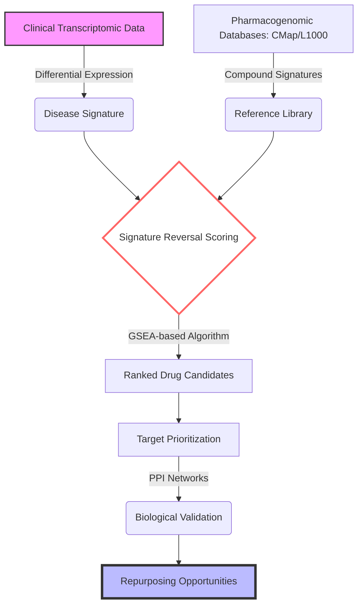

# Dr. Geoffrey Pawlak | PharmD, PhD
### Oncology Bioinformatics Researcher

I focus on identifying actionable biological levers in oncology by leveraging **DNA-seq** and **RNA-seq** data at **bulk** or **single-cell** level. My approach prioritizes high-performance, interoperable, and reproducible computational frameworks to bridge the gap between dry-lab findings and clinical applications.

---

## Research Focus & Vision
* **Current Research:** Decoding complex oncogenic mechanisms through multi-omics integration and robust statistical modeling of bulk sequencing data.
* **Strategic Direction:** Transitioning towards **Single-Cell Technology Integration** to resolve intratumoral heterogeneity and refine precision oncology strategies.

---

## Computational Expertise

 
 

* **R & Bioconductor:** Expert in high-performance R coding (S4/R6). I strictly follow `snake_case` conventions, ensuring full English documentation and code interoperability for the scientific community.
* **Python:** Focused on large-scale data manipulation and transitioning towards single-cell technology integration (Scanpy/AnnData).
* **Workflows & Automation:** Advanced implementation of **Snakemake** pipelines for reproducible DNA/RNA-seq analysis.
* **Infrastructure & Scalability:** Expert use of **Docker** for containerization and **High-performance computing (HPC)** for managing intensive bioinformatic workloads.
* **Bash:** Mastering CLI environments for efficient file system management and job scheduling in cluster environments.

---

## Scientific Contributions & Projects

### Socials

### Example of research projects

#### **[System biology approch on cancers]**

GBM-cRegMap: A coregulatory influence map of glioblastoma (GBM) 

Objective: Developing a unified network influence map to navigate GBM heterogeneity and plasticity.

Methodology: Used representation learning and the h-LICORN algorithm to infer a highly specific coregulatory network (GBM-CoRegNet) from 1,612 tumors.

Key Findings: Refined GBM classification into seven molecular classes , identifying the CL-C "cilium-rich" subclass as an intermediate state linked to chemotherapy resistance.

Regulators: Identified PAX8 and NKX2.5 as master regulators; NKX2.5 negatively impacts survival by regulating glucose metabolism.

#### **[Therapeutic repurposing pipeline]**

This project implements an optimized computational workflow for identifying drug repurposing opportunities through transcriptomic signature analysis.

Architecture: Integration of pharmacogenomic databases (CMap/L1000) with clinical differential expression profiles.

Methodology: High-performance R implementation of signature reversal scoring to prioritize compounds capable of normalizing pathological states.

Pragmatic Approach: Focuses on identifying molecules with established safety profiles to accelerate clinical translation.

---

## 📫 Connect with me
)
