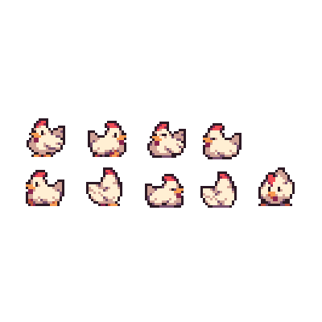

### Hi there 👋

<!--
**pawlakG/pawlakG** is a ✨ _special_ ✨ repository because its `README.md` (this file) appears on your GitHub profile.

Here are some ideas to get you started:

- 🔭 I’m currently working on ...
- 🌱 I’m currently learning ...
- 👯 I’m looking to collaborate on ...
- 🤔 I’m looking for help with ...
- 💬 Ask me about ...
- 📫 How to reach me: ...
- 😄 Pronouns: ...
- ⚡ Fun fact: ...
-->

---
/!\ W.I.P./!\
---

# Hi, I'm Geoffrey :wave:

Data scientist, PhD student, pharmacist, aspiring to bring out of data the decisions that will take you forward.

## Education

I'm curretly a **PhD student** at OncoLille Cancer Institute in the CANTHER « Cancer Heterogeneity, Plasticity and Resistance to Therapies » team.

I'm a **Data scientist** with a master degree in Health Data Science 💻.

I'm also a **Pharmacist** graduate of the Lille Faculty of Pharmacy ⚕️. 

In my early higher studies I obtained a two-years studies diploma in chemistry 🥼.

## Skills

### Health

### Data science

_Other skills: :paintbrush: graphics design, :man_dancing: breakdancing,
:skateboard: skateboarding, :computer_mouse: interactive experiences._

## Life

        <a href="https://www.linkedin.com/in/geopaw/">Let's connect and talk!</a>
    </b>

